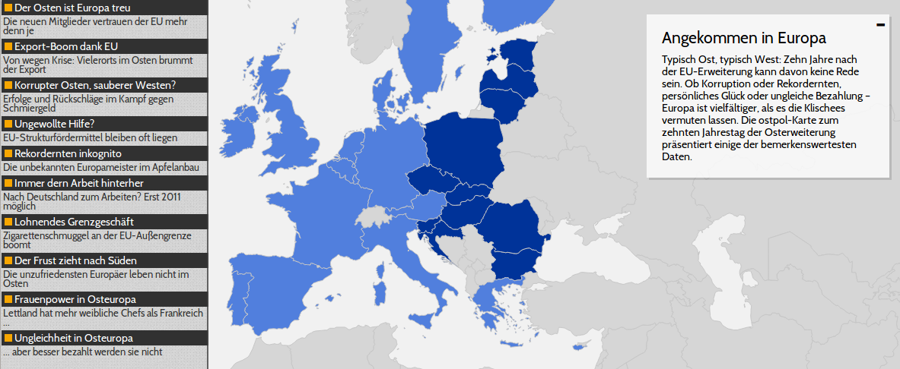

n-ost : Map for the 10th anniversary of the EU-enlargement
==========================================================

Berlin, January 2014

## The project

[http://jplusplus.github.io/nost-10years/](http://jplusplus.github.io/nost-10years/)

published on [http://www.ostpol.de/europakarte](http://www.ostpol.de/europakarte)

### Features

* Read projects from csv files
* Visualize them on a map (choropleth or symbols map)
* Handles multiple data series
* Settings file to custom how projects are shown ([settings.coffee](assets/coffee/settings.coffee))
* Custom zoom and scale for project
* Deep linking



### Licence

(c) n-ost 2014

## Installation

### Dependances

	$ sudo apt-get install build-essential python-pip python-dev

and install virtualenv

	$ sudo pip install virtualenv

### Setup a virtualenv and download dependances

	$ make install

### Run the server

	$ make run

#### No Python dependances

* [CoffeeScript](http://coffeescript.org/)

### Launch

```
$ make run
```
